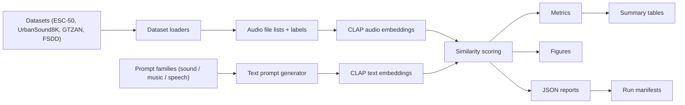

# CLAP Reimplementation and Extended Evaluation Report

## COL868 Special Topics in DBMS

**Project submitted by:** Shuvam Chakraborty, Arfin Khan, Bhuvnesh Kumar

## 1. Executive Summary

This project rebuilt the zero-shot CLAP evaluation pipeline across the paper
benchmark datasets and then extended it with new analyses.

The final verified experiment run includes:

- `ESC-50`
- `UrbanSound8K`
- `GTZAN`
- `FSDD`

The final run used:

- the official LAION CLAP implementation from `clap-official`
- this repository as the evaluation and analysis layer
- the `630k-audioset-best.pt` checkpoint
- a fully verified WSL2 pipeline with manifest and acceptance checks

The project makes three substantive improvements beyond a plain re-run:

1. It adds `FSDD`, a speech-focused dataset not included in the original paper benchmark.
2. It adds richer metrics: Macro-F1, Balanced Accuracy, Top-5 Accuracy, MRR, ECE, and prompt sensitivity.
3. It adds and evaluates prompt ensembling for CLAP, including both uniform and entropy-weighted variants.

The main scientific finding is that prompt ensembling does **not** reliably help
CLAP. It gives only a tiny improvement on `ESC-50` and degrades performance on
`UrbanSound8K`, `GTZAN`, and `FSDD`.

## 2. Project Objective

The goal of the project was twofold:

- reproduce the zero-shot audio classification behavior of CLAP on the original benchmark suite
- extend the evaluation to reveal strengths, limitations, and prompt sensitivity more clearly

Because the final verified run uses the stronger `630k-audioset-best.pt`
checkpoint, the most accurate description of the result is:

- **full benchmark reproduction with an improved checkpoint**
- **plus extension experiments**

It should not be described as an exact same-checkpoint replication of the
original paper.

## 3. Repository Roles

Two repositories were used together.

- `clap-official`
  - source of the actual `laion_clap` model implementation
- `clap-reimpl`
  - source of the dataset loaders, metric computation, figure generation, run wrappers, manifests, checkpoint tooling, and final report assets

This repo is therefore the **experiment layer** rather than a standalone CLAP implementation.

## 4. System Design

The design intentionally separates:

- model implementation
- dataset preparation
- evaluation logic
- reproducibility logging

This made it possible to repair the environment, change checkpoints, and add
new datasets without rewriting the core model code.

## 5. Implementation Details

### 5.1 Dataset abstractions

The main benchmark runner is implemented in
[scripts/analysis/run_zeroshot_metrics.py](/C:/Users/arfin/Desktop/sdbms-proj/CLAP/scripts/analysis/run_zeroshot_metrics.py).

Its design centers on a `DatasetBundle` abstraction containing:

- dataset key
- display name
- root directory
- prompt family
- class names
- audio files
- numeric labels
- dataset-specific metadata

Supported datasets are:

- `esc50`
- `urbansound8k`
- `gtzan`
- `fsdd`

### 5.2 Prompt families

The evaluation uses three prompt families:

- `sound`
- `music`
- `speech`

Each family contains five prompt templates. These are chosen by dataset:

- `ESC-50` and `UrbanSound8K` use `sound`
- `GTZAN` uses `music`
- `FSDD` uses `speech`

This is important because the final results show that phrasing matters
substantially on some datasets.

### 5.3 Caching strategy

Audio and text embeddings are cached under `outputs/embeddings/<dataset>/`.

This reduces rerun cost and makes repeated evaluation practical. The cache
stores:

- `audio_embeddings.npy`
- `labels.npy`
- `audio_files.json`
- prompt-specific text embedding arrays
- ensemble text embeddings

### 5.4 Metrics

The extended benchmark computes:

- Top-1 Accuracy
- Macro-F1
- Balanced Accuracy
- Top-5 Accuracy
- MRR
- ECE
- Prompt Sensitivity Score (PSS)

This is materially stronger than reporting only a single accuracy number.

### 5.5 Figures

For each dataset, the pipeline generates:

- reliability diagram
- per-class accuracy plot
- confusion matrix
- prompt sensitivity plot
- ensemble comparison plot

### 5.6 Reproducibility engineering

The project also includes:

- dataset verification: [scripts/repro/verify_assets.py](/C:/Users/arfin/Desktop/sdbms-proj/CLAP/scripts/repro/verify_assets.py)
- checkpoint download and manifest creation: [scripts/setup/fetch_checkpoint.sh](/C:/Users/arfin/Desktop/sdbms-proj/CLAP/scripts/setup/fetch_checkpoint.sh)
- final acceptance check: [scripts/repro/check_acceptance.py](/C:/Users/arfin/Desktop/sdbms-proj/CLAP/scripts/repro/check_acceptance.py)
- run wrappers: [scripts/repro/run_reproduction.sh](/C:/Users/arfin/Desktop/sdbms-proj/CLAP/scripts/repro/run_reproduction.sh), [scripts/repro/run_extensions.sh](/C:/Users/arfin/Desktop/sdbms-proj/CLAP/scripts/repro/run_extensions.sh)
- run manifests capturing git commit, Python version, Torch version, CLI args, and evaluated datasets

### 5.7 GTZAN preparation

The GTZAN dataset was prepared from the raw archive, converted from `.au` to
`.wav`, and normalized to the expected `999`-file benchmark form by removing
`jazz.00054.wav`.

Preparation manifest:

- [reports/assets/manifests/gtzan_preparation.json](/C:/Users/arfin/Desktop/sdbms-proj/CLAP/reports/assets/manifests/gtzan_preparation.json)

## 6. Environment and Setup

The final successful run used:

- `Ubuntu-22.04-Clean` in WSL2
- `Python 3.10`
- `torch 2.4.1+cu121`
- `numpy 1.26.4`
- `transformers 4.30.0`
- `630k-audioset-best.pt`

One implementation note matters here:

- a small NumPy compatibility shim was added to the benchmark runner so the
  official CLAP data path could work correctly with the final environment

That compatibility fix lives in:

- [run_zeroshot_metrics.py](/C:/Users/arfin/Desktop/sdbms-proj/CLAP/scripts/analysis/run_zeroshot_metrics.py)

## 7. Experimental Design

Two experiment tracks were run.

### 7.1 Baseline track

Datasets:

- `ESC-50`
- `UrbanSound8K`
- `GTZAN`

Purpose:

- reproduce the paper benchmark suite in the final verified setup

Manifest:

- [reports/assets/manifests/full_baseline.json](/C:/Users/arfin/Desktop/sdbms-proj/CLAP/reports/assets/manifests/full_baseline.json)

### 7.2 Extension track

Datasets:

- `ESC-50`
- `UrbanSound8K`
- `GTZAN`
- `FSDD`

Purpose:

- evaluate the improved checkpoint on the full suite
- measure richer metrics
- test prompt ensembling

Manifests:

- [reports/assets/manifests/full_extensions.json](/C:/Users/arfin/Desktop/sdbms-proj/CLAP/reports/assets/manifests/full_extensions.json)
- [reports/assets/manifests/full_extensions_ensemble.json](/C:/Users/arfin/Desktop/sdbms-proj/CLAP/reports/assets/manifests/full_extensions_ensemble.json)

## 8. Final Results

### 8.1 Main benchmark metrics

| Dataset | Accuracy | Macro-F1 | Balanced Accuracy | Top-5 Accuracy | MRR | ECE |
|---|---:|---:|---:|---:|---:|---:|
| ESC-50 | 0.9150 | 0.9120 | 0.9150 | 0.9935 | 0.9499 | 0.8833 |
| UrbanSound8K | 0.7747 | 0.7786 | 0.7905 | 0.9612 | 0.8582 | 0.6382 |
| GTZAN | 0.6086 | 0.5878 | 0.6089 | 0.9570 | 0.7529 | 0.4857 |
| FSDD | 0.1053 | 0.0629 | 0.1053 | 0.5677 | 0.3133 | 0.0003 |

Source table:

- [reports/assets/tables/zeroshot_summary.csv](/C:/Users/arfin/Desktop/sdbms-proj/CLAP/reports/assets/tables/zeroshot_summary.csv)

### 8.2 Overall plots

### 8.3 Dataset-by-dataset interpretation

- `ESC-50` is the strongest result in the suite and confirms that CLAP transfers well to environmental sound events.
- `UrbanSound8K` remains strong, though prompt wording produces a more noticeable spread than on `ESC-50`.
- `GTZAN` is moderate rather than dominant, with clear confusion between close music genres such as `metal` and `rock`.
- `FSDD` is the clearest failure case, showing that general audio-language pretraining is not enough for fine-grained spoken-digit recognition.

## 9. Improvement Results

### 9.1 Added dataset: FSDD

`FSDD` is not part of the original benchmark suite. Its role in the extension
study is diagnostic: it tests whether a general audio-language representation
can transfer to a narrow speech recognition task.

Result:

- Top-1 accuracy `0.1053`

Interpretation:

- performance is barely above random for a 10-class task
- this is strong evidence that CLAP is weak on fine-grained spoken-digit recognition in zero-shot mode

### 9.2 Added metrics

The extended pipeline makes several important things visible that plain accuracy
would hide:

- `GTZAN` has moderate accuracy but much stronger Top-5 behavior (`0.9570`)
- `FSDD` has poor top-1 accuracy but much higher Top-5 (`0.5677`), showing that the model sometimes ranks the correct speech class nontrivially but fails to place it first
- `UrbanSound8K` has a meaningfully higher balanced accuracy than plain accuracy, indicating class behavior is uneven but not catastrophically so

### 9.3 Prompt ensembling

| Dataset | Worst Prompt | Best Prompt | Uniform Ensemble | Delta vs Best |
|---|---:|---:|---:|---:|
| ESC-50 | 0.9150 | 0.9265 | 0.9270 | +0.0005 |
| UrbanSound8K | 0.7747 | 0.8106 | 0.7989 | -0.0117 |
| GTZAN | 0.5966 | 0.6647 | 0.6537 | -0.0110 |
| FSDD | 0.0740 | 0.1057 | 0.0757 | -0.0300 |

Source table:

- [reports/assets/tables/ensemble_summary.csv](/C:/Users/arfin/Desktop/sdbms-proj/CLAP/reports/assets/tables/ensemble_summary.csv)

This is the strongest improvement-related conclusion in the project:

- prompt ensembling is **not** a reliable gain for CLAP
- the effect is weakly positive only on `ESC-50`
- it is negative on `UrbanSound8K`, `GTZAN`, and `FSDD`

### 9.4 Entropy-weighted ensembling

The entropy-weighted version collapsed to effectively equal prompt weights in
the final runs. In practice it matched the uniform ensemble results across all
datasets.

That is itself an interesting negative result:

- CLAP did not differentiate the prompt variants strongly enough for this
  weighting strategy to matter

## 10. Visual Analysis

### 10.1 Ensemble comparison figures

#### ESC-50

#### UrbanSound8K

#### GTZAN

#### FSDD

### 10.2 Representative confusion matrices

#### GTZAN

#### FSDD

### 10.3 Prompt sensitivity

#### ESC-50

#### GTZAN

### 10.4 Per-class accuracy

#### FSDD

## 11. What Should Be Reported in the Paper or Project Writeup

These are the high-value claims that are supported by the final run:

### Reproduction claim

- The full benchmark suite `ESC-50`, `UrbanSound8K`, and `GTZAN` was run successfully in a verified WSL pipeline.

### Important caveat

- The final benchmark run uses the stronger `630k-audioset-best.pt` checkpoint, so it should be described as an improved-checkpoint reproduction rather than an exact same-checkpoint replication of the original CLAP paper.

### Extension claims

- `FSDD` was added as a new evaluation dataset.
- Multiple richer metrics were added beyond plain accuracy.
- Prompt ensembling was implemented and evaluated.
- Prompt ensembling does not reliably improve CLAP and often hurts.
- The entropy-weighted strategy collapsed to uniform weights in practice.
- CLAP transfers poorly to zero-shot spoken-digit recognition on `FSDD`.

## 12. Reproducibility Artifacts

The final verified artifact set includes:

- checkpoint manifest:
  - [reports/assets/manifests/checkpoint_630k-audioset-best.json](/C:/Users/arfin/Desktop/sdbms-proj/CLAP/reports/assets/manifests/checkpoint_630k-audioset-best.json)
- GTZAN preparation manifest:
  - [reports/assets/manifests/gtzan_preparation.json](/C:/Users/arfin/Desktop/sdbms-proj/CLAP/reports/assets/manifests/gtzan_preparation.json)
- full baseline manifest:
  - [reports/assets/manifests/full_baseline.json](/C:/Users/arfin/Desktop/sdbms-proj/CLAP/reports/assets/manifests/full_baseline.json)
- full extension manifest:
  - [reports/assets/manifests/full_extensions.json](/C:/Users/arfin/Desktop/sdbms-proj/CLAP/reports/assets/manifests/full_extensions.json)
- full ensemble manifest:
  - [reports/assets/manifests/full_extensions_ensemble.json](/C:/Users/arfin/Desktop/sdbms-proj/CLAP/reports/assets/manifests/full_extensions_ensemble.json)
- final acceptance report:
  - [reports/assets/manifests/acceptance_check_full.json](/C:/Users/arfin/Desktop/sdbms-proj/CLAP/reports/assets/manifests/acceptance_check_full.json)

The final acceptance report ended with:

- `all_ok = true`

## 13. Limitations

- The final benchmark comparison is not a strict same-checkpoint replication of the original paper.
- The environment had to be stabilized to a working CUDA-compatible stack in WSL, so the exact package mix should be treated as part of the reported method.
- The GTZAN dataset required explicit raw-data conversion from `.au` to `.wav` and removal of the known corrupted sample.

## 14. Final Conclusion

This project successfully produced:

- a complete four-dataset CLAP benchmark run
- a reproducible WSL-based execution pipeline
- richer evaluation metrics
- a new diagnostic dataset
- a validated negative result on prompt ensembling

The most important scientific outcome is not just that CLAP performs well on
environmental sounds, but that its improvements are uneven and its prompt
ensemble behavior is far less helpful than one might expect from CLIP-style
intuition.
