# CLAP Reimplementation and Extended Evaluation Report

## COL868 Special Topics in DBMS

**Project submitted by:** Shuvam Chakraborty, Arfin Khan, Bhuvnesh Kumar

## 1. Executive Summary

This project studies **zero-shot audio classification** using CLAP
(Contrastive Language-Audio Pretraining). The main task is to classify an input
audio clip without task-specific supervised training by comparing its embedding
with text embeddings generated from class prompts such as "this is a sound of a
dog barking" or "this audio is blues music".

Our work is not only a benchmark rerun. It is a **reproduction-plus-extension**
study with a complete reproducible pipeline. We rebuilt the evaluation setup,
verified it in WSL2, and ran the full benchmark suite over:

- `ESC-50`
- `UrbanSound8K`
- `GTZAN`
- `FSDD`

The final verified run uses:

- the official LAION CLAP implementation from `clap-official`
- this repository as the experiment and analysis layer
- the improved `630k-audioset-best.pt` checkpoint
- a WSL2-based reproducible execution path with manifests and acceptance checks

The strongest findings are:

1. CLAP transfers very well to environmental sound recognition.
2. CLAP remains useful, though less dominant, on urban sound and music genre
   classification.
3. CLAP performs poorly on spoken-digit recognition in zero-shot mode.
4. Prompt ensembling does **not** reliably improve CLAP and is best reported as
   a negative result.

Because the final verified run uses a stronger checkpoint than the one normally
associated with the original paper comparison, the most accurate description of
the project is:

- **full benchmark reproduction with an improved checkpoint**
- **plus extension experiments and analysis**

## 2. Introduction and Motivation

The original CLAP idea is attractive because it extends the CLIP-style
contrastive learning paradigm from image-text to audio-text. Instead of
training a classifier for each downstream task, CLAP learns a shared embedding
space in which audio clips and natural-language descriptions can be compared
directly. This opens the possibility of **zero-shot transfer**: predicting
classes by prompt matching rather than supervised retraining.

That idea raises several research questions that motivated this project:

- How well does CLAP actually transfer to diverse audio domains?
- Are published benchmark-style results reproducible in a clean environment?
- Does prompt wording materially affect performance?
- Can prompt ensembling, inspired by CLIP-style prompt ensembling in vision,
  improve robustness?
- What happens when CLAP is tested on a speech-oriented task rather than
  environmental sound or music?

We designed the project around these questions. Rather than reproducing only
one headline number, we built a benchmark pipeline that can also expose where
CLAP is robust, where it is fragile, and which extensions are actually useful.

## 3. Project Goals and Main Task

The project has one central task:

- perform **zero-shot audio classification** by matching audio embeddings to
  text embeddings generated from class prompts

This central task was pursued through two concrete goals:

1. reproduce the paper-style benchmark on `ESC-50`, `UrbanSound8K`, and
   `GTZAN`
2. extend the benchmark with:
   - `FSDD`
   - richer metrics
   - prompt sensitivity analysis
   - prompt ensembling
   - reproducibility tooling

So the project is both:

- a **systems/engineering task**: build a stable and reproducible evaluation
  pipeline
- an **empirical analysis task**: study what CLAP does well and where it fails

## 4. Paper Idea and CLAP Background

The underlying paper idea is to learn two encoders jointly:

- an audio encoder `f_a(x)`
- a text encoder `f_t(y)`

where:

- `x` is an audio clip
- `y` is a text description

The encoders are trained so that matched audio-text pairs have similar
embeddings and mismatched pairs are pushed apart. After training, a downstream
classification task can be solved in zero-shot fashion by converting class
labels into natural-language prompts and selecting the most similar text
embedding for each audio clip.

If `z_a = f_a(x)` and `z_t = f_t(y)`, the similarity score is typically based
on cosine similarity:

```text
s(x, y) = cos(z_a, z_t) = (z_a . z_t) / (||z_a|| ||z_t||)
```

For a class set `C = {c_1, ..., c_K}`, we create prompts
`p(c_1), ..., p(c_K)`, encode them, and predict:

```text
y_hat = argmax_k s(x, p(c_k))
```

In practice, prompt phrasing matters. If a class has multiple prompt templates,
for example:

- "this is a sound of {label}"
- "the audio contains {label}"
- "a recording of {label}"

then each template produces a different text embedding. This is the key reason
our project examined prompt sensitivity and prompt ensembling.

## 5. Zero-Shot Formulation Used in This Project

Our evaluation pipeline follows the same high-level procedure on every dataset.

Given:

- an audio clip `x_i`
- a class set `C = {c_1, ..., c_K}`
- a prompt family `T = {t_1, ..., t_M}`

we generate prompts:

```text
p_{k,m} = t_m(c_k)
```

Then we compute:

```text
z_i = f_a(x_i)
q_{k,m} = f_t(p_{k,m})
```

For a single prompt template, the class score is:

```text
s_k^{(m)} = cos(z_i, q_{k,m})
```

For prompt ensembling, we aggregate text embeddings or scores across prompt
templates.

Uniform ensemble:

```text
q_k^ens = (1/M) sum_m q_{k,m}
```

Weighted ensemble:

```text
q_k^ens = sum_m w_m q_{k,m},    where sum_m w_m = 1
```

The final prediction becomes:

```text
y_hat_i = argmax_k cos(z_i, q_k^ens)
```

This project implements both:

- uniform averaging
- entropy-weighted averaging

The empirical result is that the weighting scheme collapses to nearly uniform
weights in the final runs, which is itself informative.

## 6. Repository Roles and Overall Design

Two repositories were used together.

- `clap-official`
  - source of the actual `laion_clap` model implementation
- `clap-reimpl`
  - source of dataset loading, prompt generation, metric computation, figure
    generation, run wrappers, manifests, checkpoint tooling, and the final
    report

This means the current repository should be understood as the
**experiment/analysis layer**, not as a standalone reimplementation of the core
CLAP model.

### 6.1 System Flow

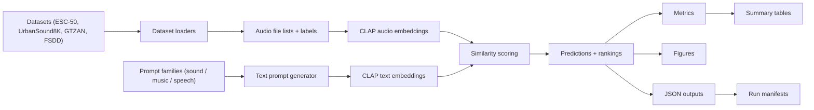

The design intentionally separates:

- model implementation
- dataset preparation
- benchmark logic
- reporting and figures
- reproducibility logging

That separation was important in practice because it let us:

- stabilize the environment without rewriting the core model
- switch to the improved checkpoint
- add `FSDD`
- add new metrics and plots
- rerun analyses cleanly using cached embeddings

## 7. Dataset Setup and Evaluation Scope

### 7.1 Datasets

| Dataset | Samples | Classes | Domain | Track | Default Prompt Family |
|---|---:|---:|---|---|---|
| `ESC-50` | 2000 | 50 | Environmental sound | Baseline + Extension | `sound` |
| `UrbanSound8K` | 8732 | 10 | Urban sound | Baseline + Extension | `sound` |
| `GTZAN` | 999 | 10 | Music genre | Baseline + Extension | `music` |
| `FSDD` | 3000 | 10 | Spoken digits | Extension only | `speech` |

### 7.2 Experiment Tracks

Two experiment tracks were run.

#### Baseline track

Datasets:

- `ESC-50`
- `UrbanSound8K`
- `GTZAN`

Purpose:

- reproduce the original benchmark-style dataset suite in the verified setup

Manifest:

- [reports/assets/manifests/full_baseline.json](/C:/Users/arfin/Desktop/sdbms-proj/CLAP/reports/assets/manifests/full_baseline.json)

#### Extension track

Datasets:

- `ESC-50`
- `UrbanSound8K`
- `GTZAN`
- `FSDD`

Purpose:

- test the improved checkpoint on the extended suite
- evaluate richer metrics
- analyze prompt sensitivity
- test prompt ensembling

Manifests:

- [reports/assets/manifests/full_extensions.json](/C:/Users/arfin/Desktop/sdbms-proj/CLAP/reports/assets/manifests/full_extensions.json)
- [reports/assets/manifests/full_extensions_ensemble.json](/C:/Users/arfin/Desktop/sdbms-proj/CLAP/reports/assets/manifests/full_extensions_ensemble.json)

## 8. Implementation Details

### 8.1 Dataset abstraction

The main benchmark runner is implemented in
[scripts/analysis/run_zeroshot_metrics.py](/C:/Users/arfin/Desktop/sdbms-proj/CLAP/scripts/analysis/run_zeroshot_metrics.py).

The pipeline centers around a `DatasetBundle` abstraction that stores:

- dataset key
- display name
- root directory
- prompt family
- class names
- audio paths
- numeric labels
- dataset-specific metadata

Supported dataset keys are:

- `esc50`
- `urbansound8k`
- `gtzan`
- `fsdd`

### 8.2 Prompt families

Three prompt families are used:

- `sound`
- `music`
- `speech`

Each family contains multiple templates, and each dataset is assigned the most
natural family:

- `ESC-50` and `UrbanSound8K` use `sound`
- `GTZAN` uses `music`
- `FSDD` uses `speech`

This is important because prompt phrasing measurably changes performance on
some datasets, especially `GTZAN` and `FSDD`.

### 8.3 Embedding caching

Audio and text embeddings are cached under `outputs/embeddings/<dataset>/`.

This cache stores:

- `audio_embeddings.npy`
- `labels.npy`
- `audio_files.json`
- prompt-specific text embedding arrays
- ensemble embedding outputs

Caching reduced rerun cost substantially during debugging and extension
experiments.

### 8.4 Generated outputs

For each dataset, the extended pipeline generates:

- metrics JSON
- confusion matrix
- reliability diagram
- per-class accuracy plot
- prompt sensitivity plot
- ensemble comparison plot

At the global level, it also generates:

- summary CSV tables
- summary plots
- run manifests
- acceptance reports

## 9. Environment, Setup, and Engineering Notes

The final successful run used:

- `Ubuntu-22.04-Clean` in WSL2
- `Python 3.10`
- `torch 2.4.1+cu121`
- `numpy 1.26.4`
- `transformers 4.30.0`
- checkpoint `630k-audioset-best.pt`

One engineering detail mattered for stability:

- a small NumPy compatibility shim was added so the benchmark runner could work
  cleanly with the final environment and the official CLAP data path

This fix lives in:

- [scripts/analysis/run_zeroshot_metrics.py](/C:/Users/arfin/Desktop/sdbms-proj/CLAP/scripts/analysis/run_zeroshot_metrics.py)

The environment story matters because the project was not only about getting a
number once. A major part of the work was building a setup that could be
executed again reliably in WSL with documented commands and tracked artifacts.

## 10. Reproducibility and Dataset Preparation

The final artifact set includes:

- dataset verification
- checkpoint manifest generation
- baseline and extension manifests
- GTZAN preparation manifest
- final acceptance check

### 10.1 GTZAN preparation

`GTZAN` required explicit preparation:

- the raw archive was obtained
- audio files were converted from `.au` to `.wav`
- the dataset was normalized to the expected benchmark form
- the known problematic file `jazz.00054.wav` was removed

Preparation manifest:

- [reports/assets/manifests/gtzan_preparation.json](/C:/Users/arfin/Desktop/sdbms-proj/CLAP/reports/assets/manifests/gtzan_preparation.json)

### 10.2 Acceptance and verification artifacts

- checkpoint manifest:
  - [reports/assets/manifests/checkpoint_630k-audioset-best.json](/C:/Users/arfin/Desktop/sdbms-proj/CLAP/reports/assets/manifests/checkpoint_630k-audioset-best.json)
- full baseline manifest:
  - [reports/assets/manifests/full_baseline.json](/C:/Users/arfin/Desktop/sdbms-proj/CLAP/reports/assets/manifests/full_baseline.json)
- full extension manifest:
  - [reports/assets/manifests/full_extensions.json](/C:/Users/arfin/Desktop/sdbms-proj/CLAP/reports/assets/manifests/full_extensions.json)
- full ensemble manifest:
  - [reports/assets/manifests/full_extensions_ensemble.json](/C:/Users/arfin/Desktop/sdbms-proj/CLAP/reports/assets/manifests/full_extensions_ensemble.json)
- final acceptance report:
  - [reports/assets/manifests/acceptance_check_full.json](/C:/Users/arfin/Desktop/sdbms-proj/CLAP/reports/assets/manifests/acceptance_check_full.json)

The final acceptance report ended with:

- `all_ok = true`

## 11. Metrics and Mathematical Definitions

The project extends the original reporting style by adding several metrics
beyond top-1 accuracy.

### 11.1 Top-1 Accuracy

```text
Accuracy = (1/N) sum_i 1[y_hat_i = y_i]
```

This is the standard proportion of correctly classified samples.

### 11.2 Macro-F1

For each class `k`, let precision be `P_k` and recall be `R_k`. Then:

```text
F1_k = 2 P_k R_k / (P_k + R_k)
Macro-F1 = (1/K) sum_k F1_k
```

Macro-F1 treats all classes equally, which is valuable when class behavior is
uneven.

### 11.3 Balanced Accuracy

Balanced accuracy is the mean recall across classes:

```text
Balanced Accuracy = (1/K) sum_k Recall_k
```

This is especially useful when some classes are harder than others and ordinary
accuracy can hide that imbalance.

### 11.4 Top-5 Accuracy

```text
Top-5 = (1/N) sum_i 1[y_i is among the top-5 ranked classes for sample i]
```

This metric is helpful for diagnosing ranking quality even when top-1 accuracy
is only moderate.

### 11.5 Mean Reciprocal Rank (MRR)

If `rank_i` is the position of the correct class in the ranked class list for
sample `i`, then:

```text
MRR = (1/N) sum_i (1 / rank_i)
```

This captures how near the top the correct label tends to appear.

### 11.6 Expected Calibration Error (ECE)

ECE measures the gap between model confidence and empirical correctness over
confidence bins:

```text
ECE = sum_b (|B_b| / N) |acc(B_b) - conf(B_b)|
```

where `B_b` is the set of predictions in confidence bin `b`.

### 11.7 Prompt Sensitivity Score

Prompt sensitivity is not a standard universal metric, but in this project it
captures the spread in dataset performance across prompt templates. Conceptually:

```text
PSS = best_prompt_score - worst_prompt_score
```

A larger spread means the dataset is more sensitive to prompt wording.

## 12. Main Benchmark Results

### 12.1 Final metrics

| Dataset | Accuracy | Macro-F1 | Balanced Accuracy | Top-5 Accuracy | MRR | ECE |
|---|---:|---:|---:|---:|---:|---:|
| ESC-50 | 0.9150 | 0.9120 | 0.9150 | 0.9935 | 0.9499 | 0.8833 |
| UrbanSound8K | 0.7747 | 0.7786 | 0.7905 | 0.9612 | 0.8582 | 0.6382 |
| GTZAN | 0.6086 | 0.5878 | 0.6089 | 0.9570 | 0.7529 | 0.4857 |
| FSDD | 0.1053 | 0.0629 | 0.1053 | 0.5677 | 0.3133 | 0.0003 |

Source table:

- [reports/assets/tables/zeroshot_summary.csv](/C:/Users/arfin/Desktop/sdbms-proj/CLAP/reports/assets/tables/zeroshot_summary.csv)

### 12.2 Summary plots

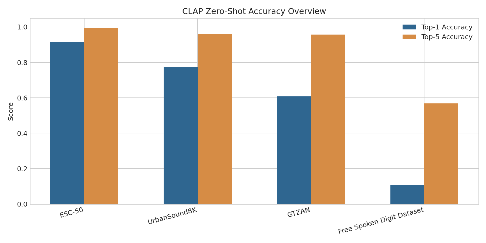

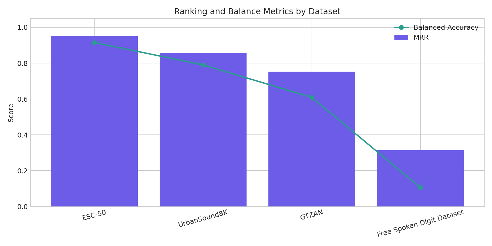

### 12.3 Interpretation

These results show a clear difficulty hierarchy.

- `ESC-50` is the strongest outcome and confirms that CLAP transfers well to
  environmental sound events.
- `UrbanSound8K` remains strong, but prompt wording matters more.
- `GTZAN` is moderate rather than dominant, with confusion among semantically
  close music genres.
- `FSDD` is the clearest failure case, showing that general audio-language
  pretraining is not enough for fine-grained spoken-digit recognition.

The richer metrics reveal things that top-1 accuracy alone would hide:

- `GTZAN` has only moderate top-1 accuracy but a very strong Top-5 score,
  meaning the model often ranks the correct genre near the top even when it
  does not place it first.
- `FSDD` has poor top-1 accuracy but a noticeably higher Top-5 score, suggesting
  weak partial awareness rather than total collapse.

## 13. Improvements Beyond the Original Benchmark

This project includes three main improvements beyond a plain rerun.

### 13.1 Improvement 1: New dataset (`FSDD`)

`FSDD` was added as a speech-focused diagnostic dataset. This is important
because it tests whether a general audio-language representation transfers to a
fine-grained speech classification task.

Result:

- top-1 accuracy: `0.1053`

Interpretation:

- performance is close to random for a 10-class task
- this is strong evidence that CLAP is weak on zero-shot spoken-digit
  recognition

This is one of the clearest limitation findings of the project.

### 13.2 Improvement 2: Richer metrics

The original style of reporting often emphasizes a single accuracy number. Our
pipeline adds:

- Macro-F1
- Balanced Accuracy
- Top-5 Accuracy
- MRR
- ECE
- prompt sensitivity analysis

This richer view changes the interpretation of multiple datasets. For example:

- `GTZAN` is not strong in top-1 accuracy, but it is much stronger as a ranking
  model than a hard classifier.
- `UrbanSound8K` behaves better under balanced accuracy than a single top-1
  number might suggest.
- `FSDD` shows weak top-1 transfer but nontrivial top-5 structure.

### 13.3 Improvement 3: Prompt ensembling

Prompt ensembling was inspired by prompt ensembling in CLIP-style image-text
models. We implemented two variants:

- uniform averaging
- entropy-weighted averaging

The expectation was that combining multiple prompt templates might stabilize
class representations. The actual result is much more negative.

| Dataset | Worst Prompt | Best Prompt | Uniform Ensemble | Delta vs Best |
|---|---:|---:|---:|---:|
| ESC-50 | 0.9150 | 0.9265 | 0.9270 | +0.0005 |
| UrbanSound8K | 0.7747 | 0.8106 | 0.7989 | -0.0117 |
| GTZAN | 0.5966 | 0.6647 | 0.6537 | -0.0110 |
| FSDD | 0.0740 | 0.1057 | 0.0757 | -0.0300 |

Source table:

- [reports/assets/tables/ensemble_summary.csv](/C:/Users/arfin/Desktop/sdbms-proj/CLAP/reports/assets/tables/ensemble_summary.csv)

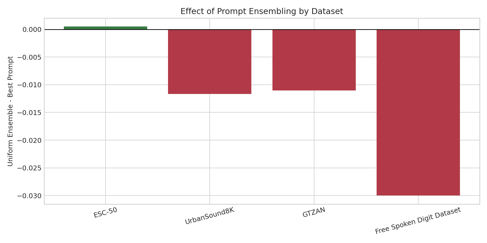

Main conclusion:

- prompt ensembling is **not** a reliable improvement for CLAP
- it is only marginally positive on `ESC-50`
- it degrades performance on the other three datasets

### 13.4 Entropy-weighted ensembling result

The entropy-weighted scheme effectively collapsed to nearly uniform weights in
the final runs. That means CLAP did not differentiate prompt variants strongly
enough for the weighting scheme to create a meaningful advantage.

This is an important negative result and should be reported as such.

## 14. Visual Analysis

### 14.1 Ensemble comparison figures

#### ESC-50

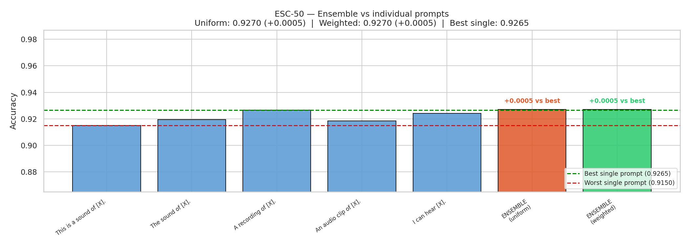

#### UrbanSound8K

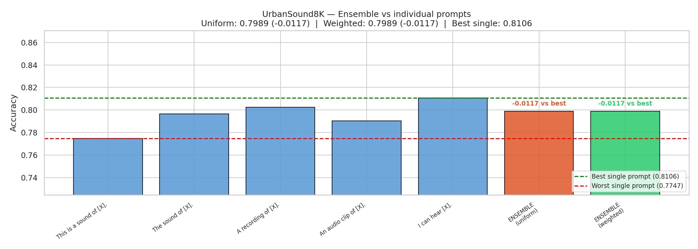

#### GTZAN

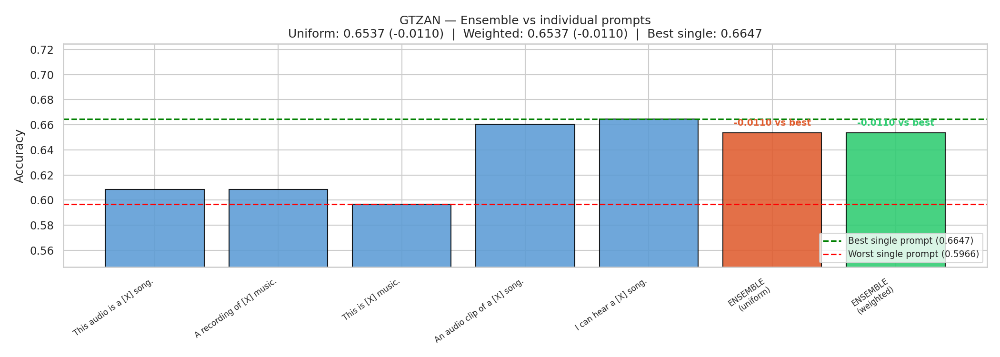

#### FSDD

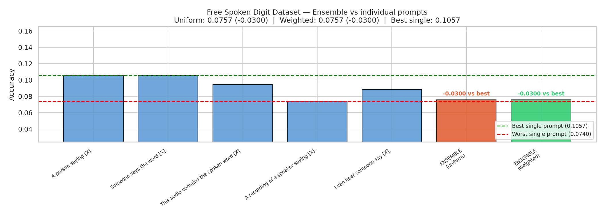

### 14.2 Confusion matrices

#### GTZAN

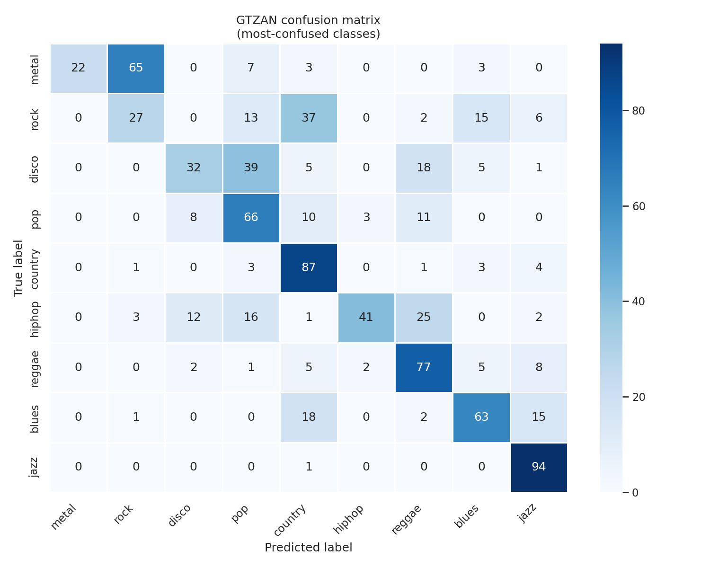

#### FSDD

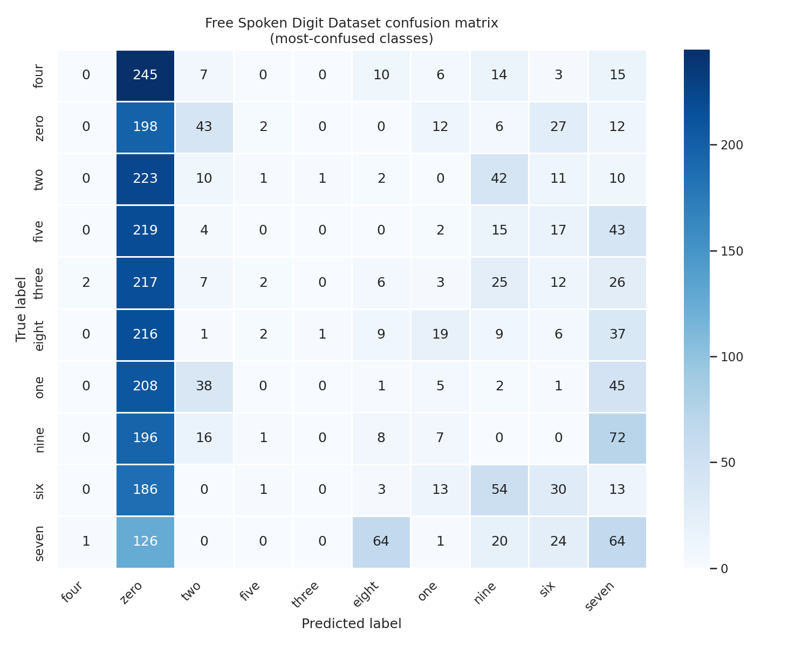

These matrices reinforce the quantitative story:

- `GTZAN` errors cluster among related genres, which suggests partial semantic
  structure rather than total failure.
- `FSDD` shows broad confusion across digit classes, which matches the weak
  zero-shot transfer result.

### 14.3 Prompt sensitivity plots

#### ESC-50

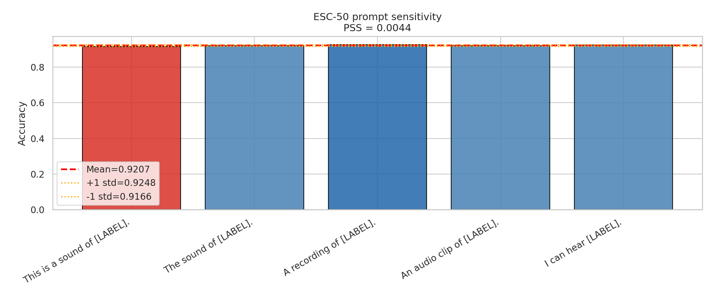

#### GTZAN

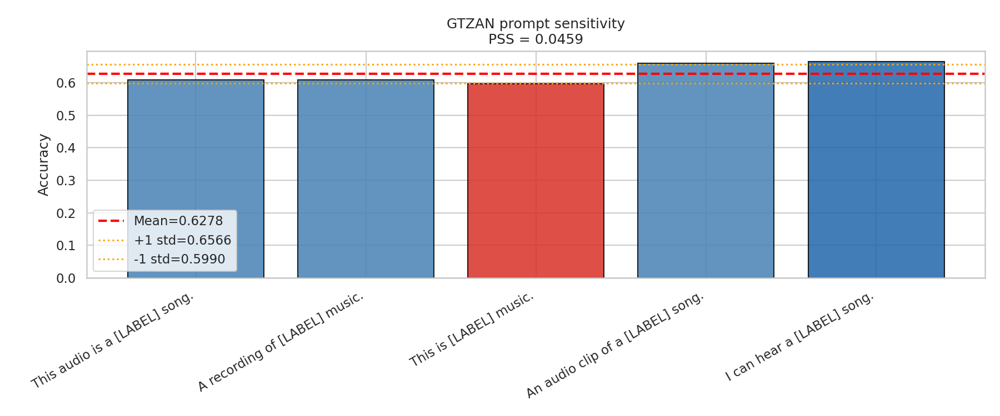

These plots show that prompt wording matters more on some datasets than others.
This helps explain why ensembling can fail: if the best prompt is meaningfully
better than the others, averaging can dilute useful signal.

### 14.4 Reliability diagrams

#### ESC-50

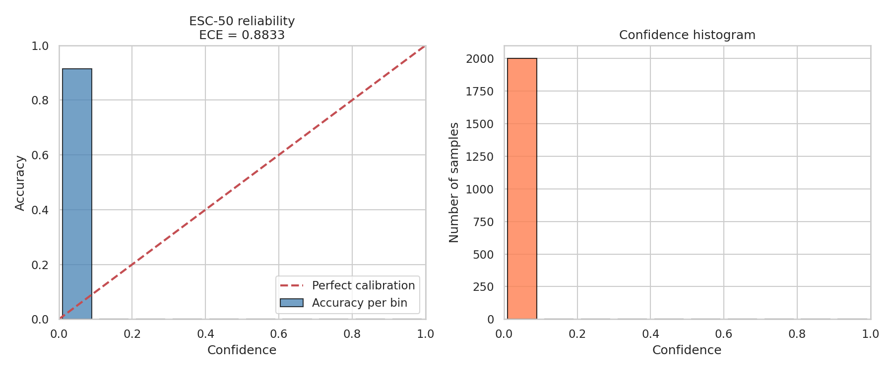

#### UrbanSound8K

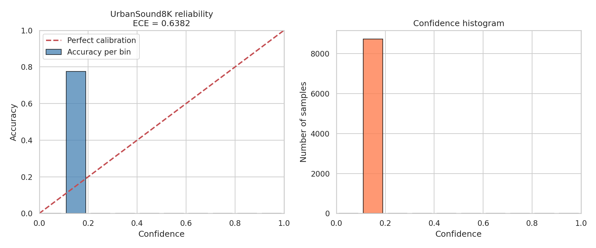

#### GTZAN

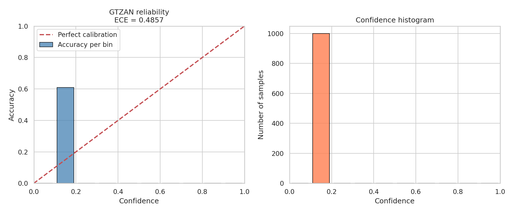

#### FSDD

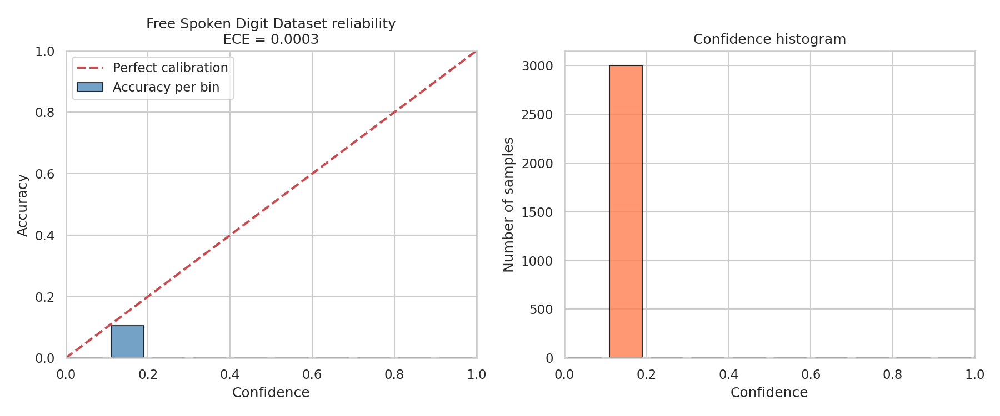

### 14.5 Per-class accuracy examples

#### ESC-50

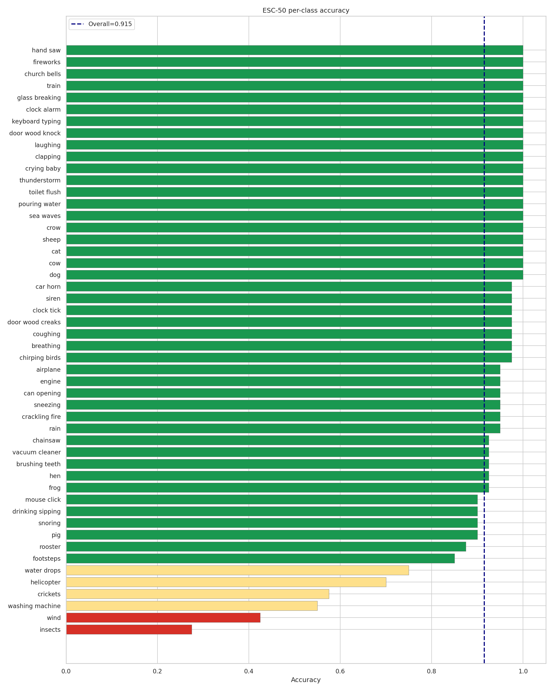

#### UrbanSound8K

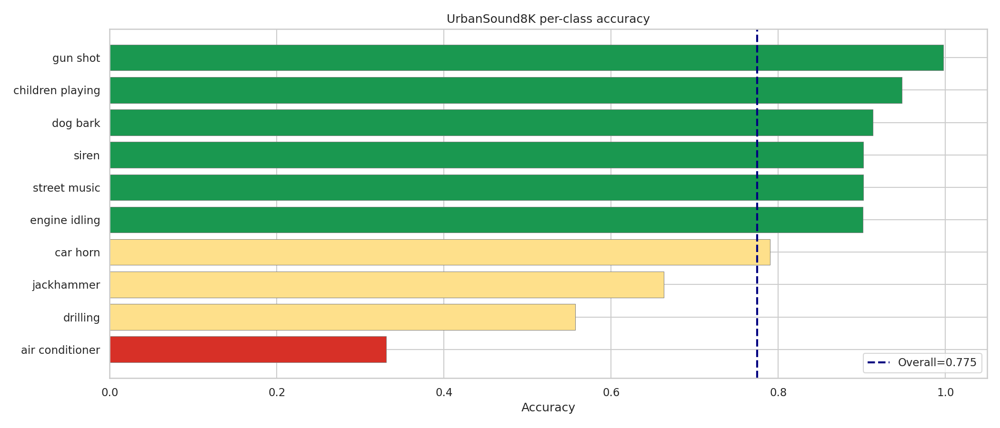

#### GTZAN

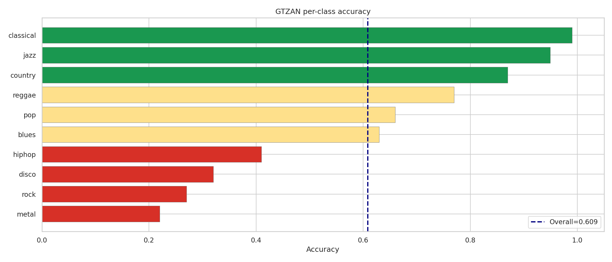

#### FSDD

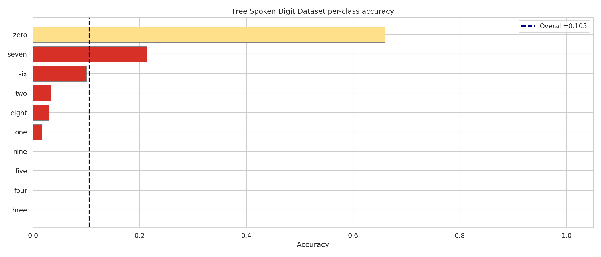

## 15. Discussion

Scientifically, the project gives a balanced picture of CLAP:

- it is genuinely strong on environmental sound recognition
- it remains useful on urban sound recognition
- it is workable but limited on music genre classification
- it is weak on fine-grained spoken-digit recognition

The most important insight is that CLAP's transfer ability is
**domain-sensitive**, not uniformly strong.

Three points matter especially in the final write-up:

1. the benchmark reproduction was successful, but it uses a stronger checkpoint
   than the one emphasized in the original comparison
2. richer metrics provide a more honest description than top-1 accuracy alone
3. prompt ensembling should be reported as a validated negative result rather
   than as a successful improvement

## 16. What Should Be Claimed in the Final Submission

These are the strongest claims supported by the final run.

### Reproduction claim

- The benchmark suite `ESC-50`, `UrbanSound8K`, and `GTZAN` was reproduced in a
  verified WSL pipeline.

### Important caveat

- The final benchmark run uses the stronger `630k-audioset-best.pt` checkpoint,
  so it should be described as an improved-checkpoint reproduction rather than
  a strict same-checkpoint replication.

### Extension claims

- `FSDD` was added as a new diagnostic dataset.
- Multiple richer metrics were added beyond plain accuracy.
- Prompt ensembling was implemented and evaluated.
- Prompt ensembling does not reliably improve CLAP.
- Entropy-weighted prompt ensembling collapses to effectively uniform behavior.
- CLAP transfers poorly to zero-shot spoken-digit recognition on `FSDD`.

## 17. Limitations

- The final benchmark comparison is not a strict same-checkpoint replication of
  the original paper.
- The environment had to be stabilized to a working CUDA-compatible WSL stack,
  so the exact package mix should be treated as part of the reported method.
- `GTZAN` required explicit raw-data conversion from `.au` to `.wav` and
  removal of the known corrupted sample.
- The extension conclusions are strong empirically, but they are still bounded
  by the prompt families and checkpoint used in this study.

## 18. Team Contributions and Work Distribution

| Member | Approx. Share | Primary Contribution Areas |
|---|---:|---|
| Shuvam Chakraborty | 40% | Core evaluation pipeline integration, zero-shot benchmarking workflow, metric/result consolidation, and substantial report drafting |
| Arfin Khan | 40% | Environment stabilization in WSL2, dataset preparation and verification, prompt ensembling analysis, figure generation, and reproducibility artifacts |
| Bhuvnesh Kumar | 20% | Dataset/result validation support, asset organization, selective experiment assistance, and report polishing/review |

All three members contributed to the final project discussion and submission
preparation. The split above reflects the major implementation and experiment
load while still acknowledging the shared submission effort.

## 19. Final Conclusion

This project delivered:

- a verified CLAP benchmark run over four datasets
- a reproducible WSL execution setup
- richer evaluation metrics
- a new diagnostic dataset
- a clear extension study on prompt ensembling

The most important final message is balanced rather than purely celebratory:
CLAP is genuinely strong for some zero-shot audio tasks, but its gains are
uneven across domains, and prompt ensembling is not a dependable shortcut to
better performance. That combination of successful reproduction, practical
engineering, and validated negative-result analysis makes this project stronger
than a plain rerun of the benchmark.
